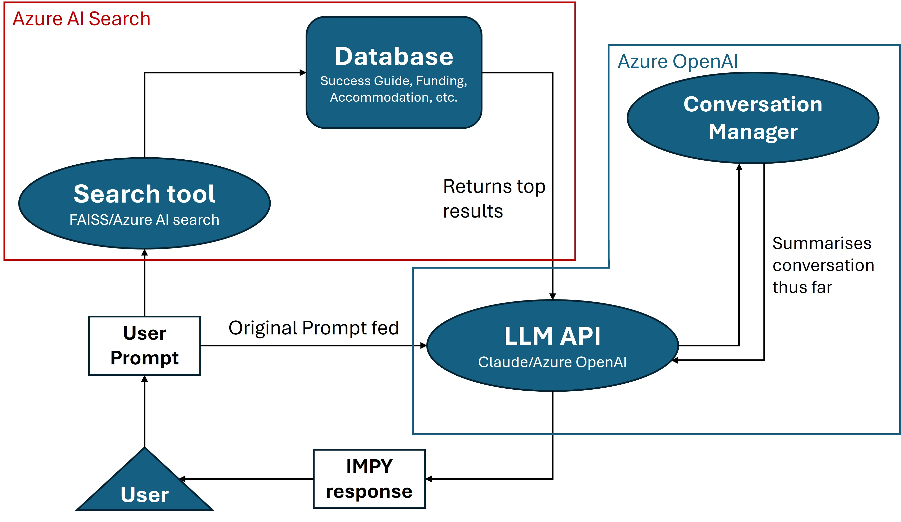

# AzureImpy v1.0

AzureImpy is the Imperial Success Guide Chatbot leveraging Azure web services, particularly **Azure AI Search** and **Azure OpenAI**. This implementation enhances the chatbot's capabilities by utilizing cloud-based services for efficient database hosting and searching.



## Table of Contents
1. [Overview](#overview)
2. [Features](#features)
3. [Setup](#setup)
4. [Code Structure](#code-structure)
5. [Usage](#usage)
6. [Configuration](#configuration)

## Overview

AzureImpy consists of a Python script (`AzureImpy.py`) that can be run in a terminal to interact with the chatbot. The script manages the interaction between various Azure services and the user interface.

Key components:
- **Azure AI Search**: Responsible for searching through the hosted database
- **Azure OpenAI**: Provides the Large Language Model (LLM) API
- **Python Script**: Manages the flow of information and calls to relevant services

Right now we are using me and Steph's personal API keys due to Azure's OpenAI token limits.

## Features

- Integration with Azure AI Search
- LLM API selection (Claude or GPT)
- Conversation management for context-aware responses
- Logging functionality for analysis
- Debug mode to see backend

## Setup

1. Clone this repository
2. Run the provided `.bat` (Windows) or `.sh` (Mac/Linux) file to set up environment variables
3. Install required dependencies:
   ```
   pip install -r requirements.txt
   ```
4. Run the script:
   ```
   python AzureImpy.py
   ```

## Code Structure

The `AzureImpy.py` script is organized into several key sections:

1. **Configuration**: Defines environment variables and LLM API selection
2. **System Prompt**: Sets the universal prompt for the LLM to embody Impy's persona
3. **Azure Functions**: Handles AI search, result processing, and API calls
4. **Conversation Manager**: Maintains context across interactions
5. **Logger**: Records conversations and token usage
6. **Main Loop**: Orchestrates the chatbot's operation

## Usage

After running the script, interact with AzureImpy by typing your queries. Use the following commands:
- `exit`: End the conversation
- `new`: Start a new conversation

## Configuration

- Set the `debug` flag to `True` to view detailed information about what's sent to the API
- Choose between 'claude' or 'gpt' for the `active_api` variable to select the LLM

